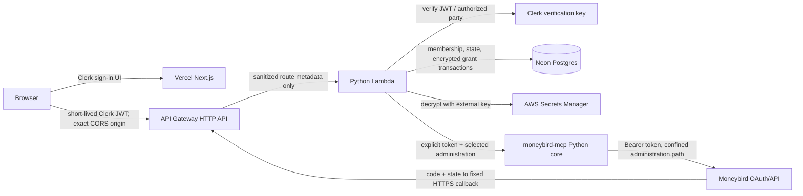

# M2 production hosted connection layer: architecture decisions

Status: **accepted for implementation**

Date: 2026-08-09

Scope: M2 only — authenticated, tenant-safe, read-only Moneybird connection

This record settles the architecture needed for the first production-grade
hosted connection slice. It deliberately does not design an AI agent, a polished
dashboard, billing, public onboarding, hosted writes, or a hosted search/index
platform.

The commercial hosted application belongs in a separate private repository. This
public record is still appropriate here because it defines the supported boundary
of the reusable Moneybird core and prevents the M1 demo from being mistaken for
production infrastructure. It contains no secret values or proprietary product
implementation.

## Verified repository baseline

The decisions below were made against `origin/main` at merge commit `61c9e3c`
(PR #32), not against an assumed earlier tree.

The prompt's source-of-truth position is accurate: M0, the OAuth foundation, and
the M1 loopback demo are present; M2 is not. In particular:

- `oauth.py` owns authorization URL construction, required state comparison,
  authorization-code exchange, refresh, redacted token-endpoint errors, and the
  documented absence of a Moneybird revocation endpoint.
- `oauth_store.py` owns `OAuthConnection`, refresh-merge semantics, redacted
  representation, and the replaceable `TokenStore` protocol. Its concrete
  `FileTokenStore` and the refresh locks are local/process-scoped, not a hosted
  transaction boundary.
- `oauth_scopes.py` owns the verified scope catalogue and profiles.
- `credentials.py` has the fail-closed `hosted_request_only` mode. It accepts one
  trusted request token and never falls back to environment or local OAuth state.
- `capabilities.py` refuses writes unconditionally in `hosted_request_only`, even
  when `MONEYBIRD_CAPABILITY_MODE=write_enabled` is present.
- `MoneybirdClient(token, administration_id, ...)` accepts explicit credentials,
  confines paths to the selected administration, can list administrations without
  selecting one, and can revalidate that the current token can reach the selected
  administration.
- hosted mode disables local durable sync/FTS/reference caches and attachment
  parsing. Those local files are not a multi-tenant storage boundary.
- PR #32 deliberately makes a new authorization-code grant start with no selected
  administration, while refresh preserves the current grant's selection.
- `gateway/` is intentionally excluded from the wheel and is an M1-only ASGI demo.
  It uses process-memory OAuth state, plaintext JSON stores, a bearer secret in a
  URL, request-derived callback origins, and first-administration selection.

One important qualification to the existing comments is that implementing a
Postgres `TokenStore` alone is not enough for M2. The protocol is keyed by a free
profile string, the installed store is global process state, and refresh is a
load/network/save sequence protected only by an in-process lock. The private app
must own user/workspace authorization, encryption, row locking, and deletion. It
may reuse `OAuthConnection` and its merge semantics without treating `TokenStore`
as the tenant boundary.

## The eight decisions

| # | Decision | Chosen option |
|---|---|---|
| 1 | Codebase boundary | Keep this repository as the reusable public Python/MCP core; create one separate private hosted-product repository. |
| 2 | Hosting/runtime | Vercel Next.js for the web UI; a stateless Python AWS Lambda behind API Gateway HTTP API for the Moneybird connection/API boundary; Neon Postgres for state. |
| 3 | Human authentication | Clerk, with separate environments; map Clerk subjects to internal UUID users and keep workspaces in Postgres. |
| 4 | Tenant model | Internal users, workspaces, memberships, immutable grant generations, per-grant administrations, and an explicit selection row. |
| 5 | Production Postgres | Separate Neon projects for staging and production; pooled application connections, direct migration connections, Alembic migrations. |
| 6 | OAuth apps/domains | Fixed local, staging, and production callback origins; separate Moneybird OAuth applications for staging and production; no preview callbacks. |
| 7 | Token encryption | AES-256-GCM application-level encryption with a versioned 256-bit key held outside Postgres; upgrade to KMS envelope encryption later if justified. |
| 8 | First slice | Two invited users/workspaces, Connect, durable state, encrypted grant, explicit administration choice, one contacts read, disconnect, and mandatory cross-tenant denial tests. |

## Decision details

### 1. Public core and private product repository

**Chosen.** `Espaye/moneybird-mcp-server` remains the source-available Moneybird
integration core. Human accounts, sessions, workspaces, database models, product
routes, deployment infrastructure, and commercial UI live in one private hosted
application repository.

The hosted backend depends on an exact released PyPI version of `moneybird-mcp`,
with hashes locked by the Python dependency tool. During development only, an
unreleased core fix may be pinned to a full immutable Git commit SHA. Staging and
production must return to a numbered PyPI release before handling real customer
credentials. Never depend on a branch name or an editable checkout in deployment.

Rejected alternatives:

- Adding product/auth/database code here couples a reusable integration to one
  commercial product and risks shipping private product concerns in the wheel.
- Copying the Python OAuth/client logic into TypeScript creates two security
  implementations and lets scope, refresh, and administration rules drift.
- Publishing a second public repository now is unnecessary; the hosted app is a
  private product boundary, not another reusable package yet.

Security implication: only the private backend may join human identity to an
encrypted Moneybird grant. The public core accepts an already-authorized explicit
request context and must never infer workspace membership.

Intentionally undecided: the private repository name and final commercial licence
arrangement. They do not change the technical boundary.

### 2. Application hosting and runtime

**Chosen.** Use two stateless tiers:

1. Next.js App Router on Vercel serves authentication UI and the minimal M2 pages.
2. A Python 3.12 Lambda behind an API Gateway HTTP API owns every Moneybird OAuth,
   credential, administration-selection, and Moneybird-operation endpoint. It
   imports the pinned Python core. API Gateway and Lambda are deployed separately
   for staging and production.

This is still a low-operations serverless design: there is no always-on host,
Kubernetes cluster, Redis service, queue, or microservice fleet. A Python boundary
is required because the reusable OAuth/client/tool semantics are Python. Lambda is
the adapter around that core, not a second implementation of it.

Why not run that Python boundary on Vercel for M2:

- Vercel's Python runtime is currently documented as Beta. That is acceptable for
  experiments, but it need not become the first production credential boundary.
- More importantly, Vercel Runtime Logs expose request search parameters and Log
  Drains can contain a proxy path with query parameters. Moneybird sends the
  authorization code in the callback query. That conflicts with the rule that an
  authorization code must never enter logs.
- API Gateway HTTP API access logs are explicitly formatted. The production format
  will include request id, route key, status, latency, and response length only —
  never raw path, query string, headers, or body. Lambda must also avoid logging the
  raw event.

Rejected alternatives:

- A pure Next.js backend would duplicate the Python core.
- A Vercel-hosted Python callback remains a future option only after Vercel can
  demonstrably suppress callback query values in platform logs.
- A long-running Python VM/container adds patching and availability work that this
  bounded synchronous slice does not need.
- Vercel Services is currently Beta and is not a release dependency. Its availability
  does not remove the callback query-logging concern above.

Security implication: the browser sends a short-lived Clerk session token to the
Python API; the Python API verifies it and is the only tier that can decrypt a
Moneybird grant. The Vercel tier never receives Moneybird tokens or authorization
codes.

Intentionally undecided: whether a later, proven Vercel Python/runtime-log offering
allows consolidation. M2 does not depend on that possibility.

### 3. Authentication provider

**Chosen.** Clerk with its Next.js SDK and hosted/prebuilt account flows. Enable
verified email, account recovery, bot/attack protection, and MFA for the invited
alpha. Configure conservative session lifetime/inactivity settings and require
session JWTs with a lifetime of at most five minutes. Require recent factor
verification for connection lifecycle, membership/ownership changes, account or
workspace deletion, and later other sensitive actions. The Python API checks
Clerk's factor-verification-age
claim against a maximum of 10 minutes; a fresh JWT by itself is not evidence of
step-up. For the MFA-enabled alpha, both first- and second-factor ages must be
present, nonnegative, and at most 10 minutes; Clerk's `-1` “not verified” value is
denied. A connect attempt expires at the earlier of 10 minutes after initiation or
10 minutes after the older of those factor verifications, so the callback never
outlives the factor proof that authorized the lifecycle action. Because Clerk
reports `fva` in whole minutes, compute the remaining deadline conservatively with
a one-minute rounding margin; if no positive lifetime remains, require
reverification instead of creating the attempt.

The application creates its own `users.id` UUID and maps `(provider, subject)` to
it in `auth_identities`. Clerk's user ID is evidence from the identity provider,
not the application's tenant primary key. Clerk Organizations are not the M2
workspace authorization source; Postgres memberships are. Before lookup or
just-in-time creation, authentication checks `identity_cleanup_tasks` for the same
provider subject and denies any pending/running/failed cleanup. A locally deleted
account therefore cannot be recreated while its Clerk deletion or session
revocation is outstanding.

Rejected alternatives:

- Auth0 is mature and remains viable, but its organisation features and operational
  surface are unnecessary for this invite-only alpha.
- Supabase Auth would couple auth selection to a different database platform while
  Neon is the chosen Postgres provider.
- Custom password authentication would make the product responsible for password
  storage, recovery, abuse protection, and session hardening without product value.

Security implication: the Python API verifies every Clerk JWT signature, issuer,
expiry/not-before, audience, and `azp`/authorized party against the one canonical
frontend origin. Authentication middleware is followed by a database membership
query on every tenant operation. A valid Clerk session alone grants no workspace.
Use Clerk's supported networkless JWT public key initially, pin the accepted
algorithm, and maintain a documented key-rotation deployment procedure. Configure
an explicit API audience before requiring the `aud` claim. The Clerk Backend API
secret used for invitations/session checks/identity deletion is backend-only and is
not the JWT verification key.

Intentionally undecided: social-login providers and public sign-up. The alpha is
invite-only.

### 4. Tenant/workspace model

**Chosen.** Model users and bookkeeping customers separately from day one. The UI
may initially create one workspace per invited user, but the schema supports
multiple memberships and users without migration.

Roles are only `owner` and `member`. M2 needs no enterprise role/permission system,
but their authority is explicit:

- owners may initiate/replace a connection, choose the administration, disconnect,
  delete the workspace, and manage memberships;
- members may use the active read-only connection but may not change its lifecycle
  or tenant membership;
- every workspace must retain at least one owner. Removing or deleting the last
  owner requires transferring ownership or explicitly deleting the workspace.

Account deletion removes that user, their authentication identities, and their
memberships. It never deletes a shared workspace implicitly. Workspace deletion is
a separate owner-only operation. One workspace has at most one current Moneybird
connection, while historical connection tombstones may remain for the limited audit
period.

A reconnect creates a new connection UUID (a new grant generation), marks the old
connection `superseded`, deletes its credential material, and starts with no
administration selection. Administrations and selections are keyed by the new
connection UUID, so an old identity's administration cannot be inherited by ID.

Rejected alternatives:

- A `user.moneybird_token` column makes one-user/one-workspace irreversible and
  prevents membership authorization.
- Using Clerk Organization IDs as workspace keys makes provider state the tenant
  database and complicates provider migration.
- Reusing one connection row across reconnects makes stale administration state
  easy to retain accidentally.

Security implication: foreign keys and joined server-side lookups prove the whole
user → membership → connection → selection chain. Browser IDs are lookup inputs,
never authorization evidence.

Intentionally undecided: invitations and membership-management UI beyond the two
release-gate users.

### 5. Postgres

**Chosen.** Neon Postgres, with a separate Neon project (not merely a schema) for
staging and production. Local uses a local Postgres container or a third dedicated
development project. Production credentials are never present in local config.

Use SQLAlchemy 2 + psycopg 3 in the Python service and Alembic for forward-only,
reviewed migrations. Lambda uses Neon's pooled connection string with a deliberately
small application-side pool, `pool_pre_ping`, bounded connect/statement/lock
timeouts, and no assumption that session-local Postgres state survives between
transactions. Alembic, restore validation, and `pg_dump` use a direct connection
string. Migrations run as an explicit CI/CD promotion step, never at function cold
start. Size Lambda reserved concurrency and database pool bounds together so one
deployment cannot exhaust Neon connections.

Rejected alternatives:

- SQLite/file storage is not horizontally safe or transactionally tied to tenant
  authorization.
- Sharing one Neon project between staging and production makes credential and
  operator mistakes cross the environment boundary.
- ORM auto-create/push on startup can race and gives application instances schema
  mutation rights.

Security implication: the application database role has only runtime DML rights;
the migration role is separate. Foreign keys, check constraints, and partial
unique indexes enforce ownership and one-current-connection rules even when an
application check is missed.

Intentionally undecided: the paid Neon plan/region, to be selected before staging
with EU data-location and required restore-window confirmation.

### 6. Moneybird OAuth applications and domains

**Chosen domain structure** (subject only to Sipke confirming ownership of the
apex before registration):

| Environment | Frontend | Python API and Moneybird callback |
|---|---|---|
| Local | `http://localhost:3000` | `http://localhost:8000/oauth/moneybird/callback` |
| Staging | `https://staging.moneybirdmcp.nl` | `https://api.staging.moneybirdmcp.nl/oauth/moneybird/callback` |
| Production | `https://app.moneybirdmcp.nl` | `https://api.moneybirdmcp.nl/oauth/moneybird/callback` |

If that apex is unavailable, choose one owner-controlled apex once and substitute
it consistently before any OAuth application is registered. Do not use a
`*.vercel.app`, `*.execute-api.*`, PR, branch, or preview URL as a callback.

Use separate Moneybird external OAuth applications for staging and production,
with different Client IDs and Client Secrets. Local development uses a third
development application. Each redirect URI is a server-side constant and must
exactly match registration; it is never derived from `Host`, `Forwarded`, or
`X-Forwarded-*`.

Rejected alternatives:

- Sharing an OAuth app/secret across staging and production widens blast radius and
  makes callback/config mistakes harder to contain.
- Preview callbacks are unstable and can expose secrets/code to unreviewed builds.

Security implication: Client Secrets exist only in the Python service's secret
manager/environment. Preview deployments receive no Moneybird secret and render
Connect as unavailable.

Intentionally undecided: the final public brand/apex if `moneybirdmcp.nl` is not
owned or appropriate.

### 7. Credential encryption

**Chosen for the invite-only alpha.** Encrypt one canonical JSON credential payload
per connection using AES-256-GCM from an established library (`cryptography`'s
`AESGCM` in Python):

- a cryptographically random, non-reused 96-bit nonce per encryption;
- a random 256-bit key stored in AWS Secrets Manager, never in Neon, source, logs,
  Vercel, or browser-visible configuration;
- AAD with a versioned canonical encoding of environment, workspace UUID,
  connection UUID, and payload schema version;
- `ciphertext` (including authentication tag), `nonce`, `key_version`, and payload
  schema version stored in Postgres;
- a key ring that can read the previous and active version; all new writes use the
  active version, with an explicit rotation job or lazy re-encryption;
- an offline recovery copy of key material in the owner's secure password/secret
  vault, access audited and tested separately from database restore.

AES-GCM is authenticated encryption; a copied or modified row fails authentication,
and AAD prevents moving ciphertext to another connection/workspace. Never reuse a
nonce with the same key.

Rejected alternative: managed KMS envelope encryption is stronger for key access
control and audit, but adds a KMS call/cache/envelope lifecycle to every cold path.
For a tiny invite-only alpha, Secrets Manager plus a versioned application key is a
better real-security/operations trade-off. Move to KMS envelope encryption before
broad onboarding, regulated assurance, multiple operator roles, or if the key must
not be directly available to the process.

Security implication: a Neon snapshot alone cannot reveal tokens. An application
runtime compromise can still use the active key, which is the explicit residual
risk of option A.

Intentionally undecided: the date/trigger of the first KMS migration, subject to
alpha growth and security review.

### 8. First M2 vertical slice

**Chosen.** Implement exactly:

authenticated invited user → membership-checked workspace → Connect Moneybird →
fixed callback → durable one-time state → encrypted new grant → explicit
administration choice → trusted resolver → `list_contacts(limit=1)` read →
Disconnect Moneybird.

Use User A/Workspace A and User B/Workspace B. Deliberate cross-submission of the
other workspace, connection, and administration identifiers must return the same
not-found/forbidden response without touching Moneybird. This is a release gate.

Rejected alternatives: starting with chat, generic MCP exposure, search sync,
attachments, writes, billing, or public onboarding expands the security surface
before the connection boundary is proven.

Security implication: the slice exercises the authorization and deletion chain
with real persistence and two tenants, rather than proving isolated helper methods.

Intentionally undecided: M3 agent transport and M4 product UX.

## Component and trust-boundary diagram



Trust boundaries:

1. Browser input is untrusted, including every UUID and Moneybird administration ID.
2. Clerk proves a human session; Postgres membership separately authorizes a
   workspace.
3. API Gateway terminates HTTPS. Its access log format excludes query strings,
   headers, and bodies. The Lambda never logs the raw event.
4. The Python service is the only component with Moneybird Client Secrets, the
   token-encryption key, and encrypted credential read permission.
5. Neon constraints and transactions are defense in depth, not a substitute for
   server-side authorization.
6. The public core receives only a context already resolved by the trusted service.
   It never sees a browser-asserted user/workspace as proof.

## Minimum database schema

The exact SQL types/names may change in migration review, but these constraints may
not be weakened.

```text
users
  id uuid primary key
  status text not null check (status in ('active','deleting','deleted'))
  created_at timestamptz not null
  deleted_at timestamptz null

auth_identities
  id uuid primary key
  user_id uuid not null references users(id) on delete cascade
  provider text not null check (provider <> '')
  provider_subject text not null check (provider_subject <> '')
  email_snapshot text null
  unique (provider, provider_subject)

workspaces
  id uuid primary key
  name text not null
  status text not null check (status in ('active','deleting','deleted'))
  created_at timestamptz not null
  deleted_at timestamptz null

workspace_memberships
  workspace_id uuid not null references workspaces(id) on delete cascade
  user_id uuid not null references users(id) on delete cascade
  role text not null check (role in ('owner','member'))
  created_at timestamptz not null
  primary key (workspace_id, user_id)

moneybird_connections
  id uuid primary key
  workspace_id uuid not null references workspaces(id) on delete cascade
  status text not null check (status in
    ('verifying','awaiting_selection','active','verification_failed',
     'disconnected','superseded'))
  grant_generation uuid not null unique
  granted_scopes text[] not null check (cardinality(granted_scopes) > 0)
  created_at timestamptz not null
  updated_at timestamptz not null
  disconnected_at timestamptz null
  superseded_at timestamptz null
  verification_error_code text null
  verification_retryable boolean null
  check ((status = 'verification_failed') =
    (verification_error_code is not null and verification_retryable is not null))
  unique (id, workspace_id)
  partial unique (workspace_id) where status in
    ('verifying','awaiting_selection','active','verification_failed')

moneybird_credentials
  connection_id uuid primary key references moneybird_connections(id) on delete cascade
  ciphertext bytea not null
  nonce bytea not null check (octet_length(nonce) = 12)
  key_version text not null check (key_version <> '')
  payload_schema_version smallint not null check (payload_schema_version > 0)
  row_version bigint not null check (row_version > 0)
  refresh_status text not null check
    (refresh_status in ('idle','in_progress','uncertain'))
  refresh_attempt_id uuid null
  refresh_started_at timestamptz null
  updated_at timestamptz not null
  check (
    (refresh_status = 'idle' and refresh_attempt_id is null and refresh_started_at is null)
    or
    (refresh_status in ('in_progress','uncertain') and
      refresh_attempt_id is not null and refresh_started_at is not null)
  )

moneybird_administrations
  connection_id uuid not null references moneybird_connections(id) on delete cascade
  administration_id text not null
  display_name text not null
  verified_at timestamptz not null
  primary key (connection_id, administration_id)

moneybird_administration_selections
  connection_id uuid primary key references moneybird_connections(id) on delete cascade
  administration_id text not null
  selected_by_user_id uuid null references users(id) on delete set null
  selected_at timestamptz not null
  foreign key (connection_id, administration_id)
    references moneybird_administrations(connection_id, administration_id)
    on delete cascade

oauth_connect_attempts
  id uuid primary key
  state_digest bytea not null unique check (octet_length(state_digest) = 32)
  browser_nonce_digest bytea not null check (octet_length(browser_nonce_digest) = 32)
  user_id uuid not null references users(id) on delete cascade
  auth_session_id_digest bytea not null check (octet_length(auth_session_id_digest) = 32)
  workspace_id uuid not null references workspaces(id) on delete cascade
  callback_uri text not null
  created_at timestamptz not null
  expires_at timestamptz not null
  consumed_at timestamptz null
  invalidated_at timestamptz null
  foreign key (workspace_id, user_id)
    references workspace_memberships(workspace_id, user_id)
    on delete cascade
  partial unique (workspace_id) where consumed_at is null and invalidated_at is null

identity_cleanup_tasks
  id uuid primary key
  provider text not null
  provider_subject text not null
  action text not null check (action in ('delete_identity', 'revoke_sessions'))
  status text not null check (status in ('pending','running','failed','complete'))
  attempts integer not null default 0
  not_before timestamptz not null
  created_at timestamptz not null
  updated_at timestamptz not null
  partial unique (provider, provider_subject, action)
    where status in ('pending','running','failed')

security_audit_events
  id uuid primary key
  occurred_at timestamptz not null
  actor_user_id uuid null
  workspace_tombstone uuid null
  connection_tombstone uuid null
  action text not null
  result text not null
  error_category text null
  request_id text not null
  metadata jsonb not null default '{}'

rate_limit_buckets
  bucket_key bytea not null
  window_start timestamptz not null
  count integer not null check (count >= 0)
  primary key (bucket_key, window_start)
```

Do not store email addresses in operational logs. `email_snapshot` is account data,
not an authorization key, and is deleted with the account. Security audit events
use opaque IDs/tombstones and contain no Moneybird token, code, bookkeeping payload,
or sensitive headers. `selected_by_user_id` is nullable so removing a user never
blocks a shared workspace; owner authorization is proven from a locked membership
row at selection time, not from this audit field. Cleanup-task rows contain provider
identity only and never a Moneybird credential. Membership changes lock the
workspace, and an initially deferred constraint trigger refuses a commit that would
leave an active workspace without an owner. The private repository must include the
trigger in its first migration and test concurrent last-owner removal.

## OAuth state decision

Use a random opaque state value, not a self-contained signed/encrypted state token.

1. Generate 32 random bytes and encode them URL-safe.
2. Return the raw value only in the Moneybird authorization request.
3. Store only `SHA-256(state)` in Postgres, together with the authenticated internal
   user, HMAC-pseudonymized Clerk session ID, intended workspace, fixed callback
   URI, expiry, and a hash of a separate `__Host-mb_connect` browser nonce cookie.
   Derive the session-ID and source-IP HMAC subkeys from one environment-specific
   root with fixed domain labels; never pseudonymize both input classes in the same
   HMAC domain.
4. Expire at the earlier of 10 minutes after initiation or the configured recent-
   factor deadline recorded from the verified start JWT.
5. At callback, atomically `UPDATE ... SET consumed_at = now()` only when the
   digest and browser nonce match, the attempt is neither consumed nor invalidated,
   its user/workspace and owner membership are still active, and it has not expired.
   `RETURNING` is the one successful consumer. The callback cannot replace any of
   those bindings with browser parameters.
6. Commit consumption before attempting the one-use code exchange. Any failure
   requires a new connect attempt; replay receives one generic failure.

A signed state token cannot provide one-time use without server state. Because M2
already requires Postgres, hashed opaque state is simpler, supports revocation and
auditing, exposes no tenant identifiers, and survives stateless instances.

The callback must not accept a workspace parameter. The workspace comes only from
the consumed attempt row.

The callback browser need not still carry a fresh 60-second Clerk JWT after the
human spends time at Moneybird. The user/session binding was established by a
verified JWT at initiation and is resumed only by the independent state plus
HttpOnly browser nonce. The callback grants no general product session; selection
and every later operation require fresh Clerk authentication again.

Only one live connect attempt is allowed per workspace. Starting a new owner-
authorized attempt locks the workspace and invalidates every older unconsumed
attempt before inserting the new row. This makes the latest explicit Connect action
win and prevents two valid callbacks from racing to replace each other's grants.

## Connection and administration sequences

### Connect and callback

1. The frontend makes a CSRF-resistant `POST /oauth/moneybird/start` using a fresh
   Clerk bearer token in the `Authorization` header and `credentials: include` only
   so the browser will store the API-origin connect cookie. The Python API accepts
   no ambient Clerk authentication cookie. CORS allows credentials only for the
   configured frontend origin; this is not a top-level API navigation.
2. Python API verifies the JWT and recent factor age, maps it to an internal user,
   and locks an `owner` membership for the requested workspace.
3. Rate limits are charged; exact Origin and non-ambient bearer checks pass. In one
   transaction the service invalidates older attempts and creates the hashed state
   row and browser nonce. The response sets `__Host-mb_connect` and returns the URL
   built by `oauth.build_authorize_url` with the fixed callback as JSON.
4. Frontend JavaScript performs a top-level navigation to that returned Moneybird
   URL. The API never sends a cross-origin fetch redirect to Moneybird.
5. Callback rejects duplicate `state`, `code`, or `error` query parameters, extracts
   only the raw state, proves its digest/browser binding by the atomic consume, and
   then passes that independently verified raw value as `expected_state` to
   `parse_authorization_callback` before exchange. The code is not trusted or
   exchanged before the database check.
6. `exchange_authorization_code` exchanges the code exactly once. Neither the code
   nor the token response is logged or retried.
7. Immediately start a transaction and lock the workspace. Recheck that the bound
   user is still an active owner. Mark the old current connection `superseded`,
   delete its credential, selection, and administration rows, then insert and
   encrypt the new grant in `verifying` state with no selection. The ordering
   satisfies the one-current-connection partial unique index. A rollback leaves the
   old connection intact but the spent code requires a new attempt. This deliberately keeps
   PR #32's “store a spent code before verification, but inherit no administration”
   invariant.
8. Use `MoneybirdClient(token, None, require_administration=False)` to list the
   administrations for this grant and verify that the actual granted scopes contain
   the first slice's required scope. Only a non-empty list with sufficient scope may
   insert this grant's administration rows and change status to
   `awaiting_selection`. If administration listing fails transiently, or succeeds
   with zero administrations, retain the encrypted but unusable
   `verification_failed` connection with no selection and a sanitized durable
   failure code; set `verification_retryable=true` so the user may retry after a
   transient failure/provider-membership change or disconnect without repeating a
   successfully spent code. If the granted scope is insufficient, retain the
   connection only for audit/disconnect, record a sanitized scope failure with
   `verification_retryable=false`, and require a new authorization attempt with the
   correct scope; repeating administration verification cannot add scope. Clear both
   verification fields when a successful retry moves to `awaiting_selection`.
9. Redirect to a clean frontend URL with no code/state query and `Referrer-Policy:
   no-referrer`. Clear the connect cookie on every terminal callback outcome. The
   callback response is never cacheable.

### Explicit administration selection

1. The page reads candidate administrations only through a membership-checked API
   query for the workspace's current `awaiting_selection` connection.
2. The browser POSTs one candidate ID. Exact Origin/CORS, non-ambient bearer/JWT,
   user, and active-owner membership checks run again, including recent factor
   verification.
3. Lock the current connection. Join the candidate on both `connection_id` and
   `administration_id`; an ID from any other connection is indistinguishable from
   absent.
4. Construct a client for the candidate and call the core's current-administration
   access validation. That performs one live administration-list request under this
   exact decrypted grant; do not pre-list and then validate a second time.
5. Insert the selection row and change the connection to `active` in one
   transaction.

One-administration grants still require the user to click the explicit choice.
There is no M2 auto-selection.

## Trusted Moneybird context resolver

Every Moneybird operation goes through one server-side resolver. Its conceptual
contract is:

```text
resolve_moneybird_context(authenticated_session, requested_workspace_id):
  verify Clerk session and map provider subject -> internal user UUID
  SELECT membership + active connection + current selection + administration
    WHERE membership.user_id = internal user
      AND membership.workspace_id = requested workspace
      AND connection.workspace_id = membership.workspace_id
      AND selection.connection_id = connection.id
      AND administration.(connection_id, administration_id) = selection pair
  reject missing/deleting/disconnected rows
  decrypt credential with AAD(environment, workspace, connection, schema version)
  if expired: claim a durable refresh attempt; never retry an uncertain grant
  construct MoneybirdClient(token, selected administration, require_administration=True)
  revalidate current administration access for the alpha
  return an invocation-scoped context; never persist plaintext
```

Postgres cannot make a Moneybird token-endpoint call and a database commit one atomic
transaction. A lock held across the network call would serialize workers but would
not close the crash window after Moneybird rotates a refresh token and before the
new ciphertext commits. M2 therefore uses an explicit fail-closed two-phase refresh:

1. In a short transaction, lock and re-read the credential. If another worker has
   already refreshed it, use that row. A fresh `in_progress` claim makes this
   request return a sanitized temporary-unavailable response without a second token
   call; a stale claim becomes `uncertain`. Otherwise set
   `refresh_status=in_progress`, assign a random attempt UUID/start time, advance
   `row_version`, and commit.
2. Call `refresh_access_token` once outside the database transaction. Never retry
   automatically: a timeout may mean Moneybird accepted a rotating token.
3. On a successful response, lock the same row, require the matching attempt UUID,
   apply `OAuthConnection.merged_with_refresh`, encrypt and store the complete new
   payload, advance `row_version`, set the status back to `idle`, and commit before
   returning plaintext to the request.
4. A definite invalid-grant response or an uncertain network result transitions the
   credential to `uncertain`. A stale `in_progress` attempt does the same. If any
   database write recording the token-endpoint outcome cannot commit—including the
   new ciphertext after success—the already-durable `in_progress` claim remains;
   the resolver continues to deny access and ages that claim to `uncertain` once the
   stale threshold is reached. No failure path returns the credential to `idle` or
   assumes that the old ciphertext is still refreshable.

This serializes refresh across Lambda instances and detects the otherwise invisible
crash window. It may conservatively require reconnection after an ambiguous failure;
no client-side design can provide a distributed transaction with Moneybird's token
endpoint. Moneybird currently says access tokens do not expire, so the alpha path is
dormant unless an actual token response contains `expires_in`; staging must still
exercise it with a rotating-token fake. The private app does not rely on the public
core's process-local profile lock.

For M2, live administration revalidation on each operation is intentionally
conservative. It is one Moneybird request in addition to the requested contacts
read, and both requests debit the global upstream budget. If rate data later
justifies a cache, it must be in Postgres, short lived, and keyed by
connection/grant generation — never administration ID alone.

### Reusing `hosted_request_only`

The Python service starts with:

```text
MONEYBIRD_CREDENTIAL_MODE=hosted_request_only
MONEYBIRD_CAPABILITY_MODE=read_only
```

For MCP/core-tool dispatch, a trusted in-process adapter removes any browser-sent
`X-Moneybird-Token` and `X-Moneybird-Administration-Id`, runs the resolver, and
injects exactly one token and selected administration into the invocation scope.
The core then uses its existing hosted resolver and cannot fall back to a Lambda
environment token or local OAuth file. The M2 REST facade may call
`MoneybirdClient` with the same explicit resolved context, but must never use the
ambient/local `get_client()` fallback path.

The M1 `GatewayDispatcher` is a useful proof of the strip-then-inject pattern; its
URL key and store are not reused.

## Read-only containment

- Request only the core's current minimal scopes needed for the selected first
  read: `sales_invoices` alone is sufficient for the M2 contacts read. Scopes are
  not treated as write authorization.
- Keep both hosted credential mode and read-only capability mode set server-side.
- Expose only an allowlisted `list_contacts(limit=1)` facade in the first slice.
- Do not expose generic raw methods, write client methods, prepare/approve/execute,
  attachments, local sync/index, or a general MCP endpoint to the browser.
- Pin tests proving that `write_enabled` cannot override hosted refusal and that
  environment/file OAuth credentials cannot satisfy a hosted request.

## Disconnect, reconnect, and deletion

### Disconnect Moneybird

After recent factor verification and an active-owner check, one transaction locks
the workspace, current connection, and credential, deletes the credential row,
selection, and administration rows, and marks the connection `disconnected`. It
then writes a secret-free audit event. A refresh response arriving after deletion
cannot recreate the missing/changed connection row. A Moneybird read that already
passed resolution may finish because the service cannot cancel an upstream request;
no request starting after commit can resolve the connection. Plaintext is never
queued for later deletion.

The UI must say: local credential deletion stops this product from using the saved
grant; it does **not** revoke the application's authorization inside Moneybird.
Link the user to Moneybird's application/integration settings and instruct them to
remove the authorization there if they want Moneybird-side revocation.

### Reconnect

Reconnect is owner-only and creates a new connection/grant generation. It never
updates an old credential in place and never copies an administration selection.
The user selects again from the new grant's freshly retrieved administrations.

### Delete workspace/account

These are separate operations and both require recent factor verification:

- **Delete workspace:** require an active owner, lock the workspace and its current
  connection, mark the workspace `deleting`, delete encrypted credentials first,
  and cascade the workspace data in one transaction. A read that already passed
  resolution may finish; deletion cannot cancel an upstream HTTP request already in
  flight. No request starting after commit can resolve the row, and a late refresh
  result cannot recreate it. The UI reports completion only after the local commit.
- **Delete account:** before mutation, enumerate every membership and require an
  explicit active-member transfer target or explicit workspace-deletion choice for
  each workspace the user solely owns; never infer consent from account deletion.
  Then one locked transaction revalidates those choices and target memberships,
  marks the user `deleting`, applies every
  ownership transfer/workspace deletion, removes the remaining memberships from
  shared workspaces without deleting those workspaces, and inserts an
  `identity_cleanup_tasks` outbox row containing only the provider subject/action
  before cascading authentication identities. The deferred last-owner trigger is
  the final invariant at commit. Commit local credential and account removal first,
  then let a bounded worker call Clerk. Until cleanup completes, the outbox row is
  also a provider-subject denylist checked before identity lookup/provisioning. A
  Clerk failure retries the secret-free outbox; the local Moneybird grant is already
  gone where its workspace was deleted.
  This small Postgres cleanup outbox is not a general job platform; no queue service
  is introduced for M2. Delete a completed task (and therefore its provider subject)
  promptly; retain only the opaque audit outcome.

Keep only minimal security audit tombstones for 90 days, then purge them. They may
contain opaque internal IDs, action/result/category, timestamp, and request ID — no
email, Moneybird administration name/ID, token, code, payload, or response body.
Review this retention with privacy counsel before public onboarding.

### Account-data export

Before the invite-only alpha is declared GO, an authenticated user can request a
recent-factor-protected export of their own account profile and memberships. A
workspace owner can additionally export that workspace's membership, connection
status/history, selected-administration metadata, and eligible security-audit events.
Every workspace row is selected through the same membership/owner authorization
chain; another tenant's identifier yields no data.

The export is generated synchronously as sanitized JSON because M2 stores no
bookkeeping cache or attachment corpus. It never includes access/refresh tokens,
ciphertext, nonces, key versions, state/browser/session/IP digests, raw Clerk claims,
provider secrets, or internal cleanup-task subjects. The live contacts response is
transient and is not retained or included. Export generation writes only a
secret-free audit outcome and creates no durable export artifact.

### Freshness and revocation exposure

- M2 returns a direct Moneybird contacts response and stores no financial result or
  search cache. Its data-freshness statement is therefore “live provider response
  for this invocation,” not a synchronization age guarantee.
- Every new operation rechecks active Postgres membership and connection state.
  Membership removal, disconnect, workspace deletion, or local account deletion
  blocks requests starting after that database commit; an already-dispatched
  Moneybird read may finish.
- Clerk session JWT lifetime is configured to at most five minutes. A Clerk-only
  session revocation that has not also set local user state is exposed for at most
  the remaining verified JWT lifetime. Local account deletion is immediate because
  the user status/identity-cleanup denylist is checked on every request.
- Live administration-access validation occurs immediately before the one contacts
  read. A provider-side permission removal is detected on the next operation, apart
  from the unavoidable race between that validation and the already-started read.

## Rate limiting and abuse controls

Moneybird currently documents an IP-based limit of 150 requests per five minutes,
with 50 per five minutes for report endpoints, plus `Retry-After` and rate-limit
headers on throttling. A popular OAuth app may ask Moneybird for per-administration
limits, but M2 must not assume that exception.

For the invite-only alpha, use atomic Postgres fixed-window counters:

- Connect initiation: 5 per 10 minutes per user/workspace and 20 per hour per
  HMAC-pseudonymized source IP.
- Callback failures/replays: 10 per 10 minutes per source IP plus one-use state.
- Contacts operations: 15 per five minutes per user and 30 per five minutes per
  workspace.
- Every outbound Moneybird HTTP request atomically debits a separate global upstream
  bucket capped at 120 per five minutes across the deployment. Administration
  revalidation plus `list_contacts` therefore costs two global units; administration
  listing, refresh, and any later bounded retry also cost their actual units. Refuse
  before the outbound call when the budget is exhausted.
- Only the single contacts read is enabled; reports remain disabled.

Honor `Retry-After`, capture numeric rate-limit headers, and return a sanitized
retry response. Do not automatically retry authorization-code exchange or refresh.
An idempotent read may later receive one bounded retry only when the core policy and
remaining time budget permit it.

Redis, a queue, WAF custom rules, and complex adaptive quotas can wait. Basic API
Gateway throttles and Clerk abuse controls are defense in depth, not replacements
for tenant/workspace counters. Source-IP buckets use only API Gateway's trusted HTTP
API v2 event field `requestContext.http.sourceIp` (the access-log equivalent is
`$context.identity.sourceIp`), never `X-Forwarded-For` or another browser header.
The address is stored only as a domain-separated HMAC bucket key, never raw.
Expired Postgres buckets are purged by a bounded scheduled SQL cleanup.
Before broader onboarding, contact Moneybird about per-administration partner limits
and reassess shared egress behavior.

## Logging and audit policy

Application logs are structured and allow only:

- correlation/request ID;
- internal user/workspace/connection UUIDs;
- route/action and result/error category;
- timing and Moneybird HTTP status;
- numeric rate-limit headers where useful.

Never log tokens, refresh tokens, Client Secrets, authorization codes, state raw
values, encryption keys, raw Clerk JWTs/cookies, full sensitive headers, raw Lambda
events, Moneybird response bodies, or bookkeeping payloads. Do not log `str(exc)`
from an upstream error until it has been categorized/sanitized because provider
text can contain data.

API Gateway access logs use route templates rather than raw URLs and omit query,
headers, and body. Use only that explicit HTTP API access-log format; Lambda and
framework tracing must never capture the raw callback event, query, headers, or
body. CloudWatch log retention is explicit and least-privilege access is audited.
Vercel Web Analytics must ignore auth/API routes; no Log Drain may receive OAuth
callback traffic.

The `security_audit_events` table is separate from operational logs and records
only security-relevant lifecycle outcomes. It is not a bookkeeping activity log.

## Environment and secret inventory

Each environment has its own values. Staging and production share none of the
databases, encryption material, Clerk instances, Moneybird apps/secrets,
least-privilege runtime roles, secret namespaces, or canonical origins. Separate
AWS accounts are preferred; if the alpha uses one AWS account, staging and
production still use separately deployable stacks, roles, log groups, and secrets
with no cross-environment role assumption.

| Value | Local | Staging | Production |
|---|---|---|---|
| Canonical frontend/API origins | localhost constants | fixed staging domains | fixed production domains |
| Neon application URL | local/dedicated dev | staging pooled URL | production pooled URL |
| Neon migration URL | local/dedicated dev | staging direct URL, CI only | production direct URL, CI only |
| Clerk publishable/JWT verification material, issuer, API audience | development instance | staging instance | production instance |
| Clerk Backend API secret | development instance | staging backend only | production backend only |
| Moneybird Client ID/Secret | dev OAuth app | staging OAuth app | production OAuth app |
| Moneybird callback URI | localhost | fixed staging API URI | fixed production API URI |
| AES-GCM key ring/active version | disposable dev key | staging secret | production secret |
| Pseudonymization HMAC root (domain-separated session/IP subkeys) | disposable dev key | staging secret | production secret |
| AWS deployment/runtime roles | local emulator credentials | staging least privilege | production least privilege |
| Log/audit retention | short/test | 30/90 days | 30/90 days |

Only values that their provider explicitly classifies as publishable may enter a
browser bundle. Database credentials, private signing material, cryptographic
material, provider backend credentials, and Moneybird credentials stay in backend
secret management. Mark them as sensitive and never copy production values into
preview or local configuration.

## HTTPS, proxy, cookie, CORS, and CSRF model

- API Gateway and Vercel terminate public TLS. Production and staging are HTTPS
  only. HTTP receives no authenticated service.
- Disable API Gateway's default `execute-api` endpoint and deploy only explicit
  route keys; do not use a catch-all `$default` route. The custom API domain is the
  sole public backend origin.
- Redirect/callback origins come from configuration constants, never forwarded
  headers. Validate API Gateway's trusted domain/request context against the
  configured API domain before any OAuth action; a browser `Host` or
  `X-Forwarded-*` value is never the source of truth.
- API CORS allowlists exactly the one environment frontend origin, allowed methods,
  required headers, and credentialed start request; no wildcard and no reflected
  origin. Preflight responses contain no tenant data.
- Normal API calls use a short-lived Clerk bearer token. The callback additionally
  requires the random `__Host-mb_connect` cookie set by the start POST (`Secure`,
  `HttpOnly`, `SameSite=Lax`, `Path=/`, no `Domain`, short expiry) and the one-time
  DB state.
- Mutating authenticated endpoints require exact Origin, a Clerk bearer token in a
  non-simple `Authorization` header, membership, and role authorization. The Python
  API never treats an ambient cookie as authentication, so a cross-site form cannot
  authorize a mutation; CORS is defense in depth, not the authorization check.
  Sensitive lifecycle endpoints also enforce recent factor verification. GET routes
  never mutate except the OAuth callback's state- and nonce-bound one-time protocol
  transaction.
- Responses use a restrictive CSP, `frame-ancestors 'none'`, `nosniff`, a strict
  referrer policy, no-store on authenticated/callback pages, and HSTS after all
  relevant subdomains are confirmed HTTPS.
- Preview deployments have no Moneybird or production database secrets and cannot
  initiate OAuth.

## Migrations, backup, recovery, and database unavailability

1. Alembic migration files are reviewed and exercised against an empty database
   and a representative staging copy.
2. Staging migration and smoke/cross-tenant tests pass before the exact migration
   revision is promoted to production.
3. Production migration uses the direct migration role in a single controlled CI
   job before compatible application traffic is enabled. Destructive column drops
   use expand/migrate/contract, not one-step deploys.
4. Configure a paid-plan restore window appropriate for the alpha and verify it in
   the Neon console. Quarterly for the alpha, create an isolated restore/branch,
   run integrity checks, prove encrypted credentials cannot decrypt without the
   separately recovered key, and document recovery time/result.
5. Take an encrypted logical backup before destructive migrations when practical;
   use a direct connection, never the transaction pooler.
6. If Postgres is unavailable, all connect, callback, selection, resolver,
   disconnect, and delete operations fail closed with 503. Do not fall back to
   process memory, environment credentials, stale cached authorization, or a local
   file.
7. Local startup refuses any database host or environment marker classified as
   production unless an explicit guarded break-glass procedure is used outside the
   ordinary developer command.

## Failure cases and fail-closed behavior

| Failure | Required behavior |
|---|---|
| Missing/invalid Clerk session | 401; no tenant or Moneybird lookup |
| User lacks workspace membership | generic 404/403; no connection lookup result disclosed; no Moneybird call |
| Member attempts owner-only lifecycle action | generic 403; no connection mutation or Moneybird call |
| Forged, expired, or replayed state | generic connect failure; state/code not exchanged; audit category only |
| Older connect attempt was invalidated by a newer one | same generic connect failure; no code exchange |
| State belongs to another user/session/workspace | same generic failure; no callback workspace override |
| Code exchange fails | state remains consumed; no retry; start a new connect attempt |
| Grant exchange succeeds but DB replacement rolls back | old local connection remains; new code is spent; require a new attempt and never log the token response |
| Grant persisted but administration listing fails transiently | encrypted connection remains unusable with no selection; retry verification or disconnect |
| Grant can reach zero administrations | encrypted connection remains unusable with no selection; retry only after provider membership changes or disconnect |
| Grant persisted but required scope is absent | encrypted connection remains unusable; verification is non-retryable; disconnect or start a new authorization with the correct scope |
| Administration is not on this connection | reject before selection; no operation |
| Old grant administration submitted after reconnect | composite FK/join misses because connection UUID changed; reject |
| Credential authentication/decryption fails | mark connection error, alert, and deny; never try environment/local credentials |
| Refresh is refused or has an ambiguous/crashed outcome | mark credential uncertain; deny; no blind retry; reconnect |
| Connection disconnected/deleted | resolver returns no context; no Moneybird call |
| Postgres unavailable | 503 and deny; no process-memory fallback |
| Moneybird 401/403 | deny, mark connection for re-verification/reconnect; do not expose upstream body |
| Moneybird 429 | honor sanitized retry timing, charge quota, no retry storm |
| Hosted write requested | core policy refuses regardless of capability environment |
| Unknown host/preview/default execute-api origin | refuse OAuth initiation/callback; default endpoint is disabled |
| Account deletion encounters a shared workspace | delete only that user's membership; require explicit ownership transfer or workspace deletion |
| Deleted account reauthenticates before Clerk cleanup | cleanup-task subject denylist rejects identity lookup/provisioning; no user or membership is recreated |

## Release-gate tests

The first hosted repository must include unit, integration, and browser tests for:

- state replay, expiry, forged state, wrong browser nonce, and wrong user/session;
- stale factor verification at connect initiation and a connect attempt never
  outliving the configured lifecycle factor maximum;
- credentialed start-POST/CORS/cookie behavior, duplicate callback parameters, and
  a newer connect attempt invalidating an older still-unconsumed attempt;
- workspace and connection identifiers belonging to the other test tenant;
- administration ID from another tenant/connection;
- an administration from the old grant after reconnect;
- zero/one/many administration results, with explicit selection even when one
  administration exists and no usable context when zero exist;
- transient administration-list failure being retryable while insufficient granted
  scope is not;
- disconnected/deleted connection and database outage;
- ciphertext tamper, row-swap/AAD failure, wrong/missing external key, and key
  rotation read/write behavior;
- concurrent refresh claiming and rotated-refresh-token persistence, plus process
  loss after the token response but before the database update becoming
  `uncertain` rather than silently reusing the old refresh token;
- owner/member lifecycle authorization, concurrent last-owner removal, account
  deletion with a shared workspace, and deletion of the user who selected the
  current administration;
- a deleted Clerk subject being unable to recreate an internal user while identity
  cleanup is pending, running, or failed;
- account/workspace export authorization, cross-tenant denial, secret-field
  exclusion, and absence of a retained export artifact;
- `hosted_request_only` rejecting missing context despite environment and local
  OAuth credentials being present;
- hosted writes refused even when `MONEYBIRD_CAPABILITY_MODE=write_enabled`;
- callback/API logs containing none of seeded fake code, state, tokens, secrets,
  JWTs, or bookkeeping fixtures;
- User A deliberately submitting Workspace/Connection/Administration B at every
  API boundary, with an assertion that no Moneybird HTTP request was made;
- disconnect deleting credential material and reconnect starting without selection;
- spoofed forwarding headers never changing origin or rate-limit identity, and the
  default `execute-api` hostname refusing every route;
- a staging backup restore plus separate encryption-key recovery exercise.

## Reuse, adaptation, and deliberate replacement

| Existing area | M2 treatment |
|---|---|
| `oauth.build_authorize_url`, callback parser, code/refresh grants | Reuse unchanged with fixed redirect URI and durable state orchestration around them. |
| `OAuthConnection` and refresh merge | Reuse; encrypt its canonical payload and serialize hosted refresh in Postgres. |
| `TokenStore` | Do not use as the authorization boundary; private DB repository may adapt the model, but must add workspace ownership, encryption, transactions, and cross-process concurrency. |
| `oauth_scopes` | Reuse the smallest profile that covers the one enabled read. |
| `MoneybirdClient` explicit constructor, path confinement, administration list/access validation | Reuse. Never let the hosted route auto-select an administration. |
| `hosted_request_only` and capability policy | Reuse unchanged for MCP/tool dispatch; pin fail-closed tests. |
| Local JSON/SQLite/FTS/reference state | Do not migrate to hosted use. |
| `GatewayDispatcher` header stripping/injection idea | Adapt the pattern only after real auth/membership/resolution. Do not copy its URL-key identity. |
| `GatewayStore`, URL bearer key, process-memory state, first administration, request-derived callback | Deliberately replace; retain `gateway/` as labelled M1 demo. |

## Public-core implementation boundary

No code change in this public repository is required before starting the private
hosted slice. The necessary reusable primitives already exist after PR #32. Adding
a workspace-aware resolver or encrypted Postgres store here would put product
identity/database policy into the wrong repository.

The first hosted implementation may reveal a genuinely generic missing primitive.
If so, contribute only that small, tenant-neutral abstraction here with tests and a
release before production pins it. Do not weaken `hosted_request_only`, make its
headers browser-trusted, or add product models to achieve reuse.

## Owner setup required before the coding slice reaches real OAuth

Sipke must:

1. Confirm an owner-controlled product apex (use the domain pattern above) and add
   the four staging/production frontend/API DNS records.
2. Create isolated staging and production Clerk instances; configure the canonical
   frontend origins, invited users, MFA/recovery, an explicit Python-API audience,
   recent-factor policy, JWT verification material/rotation procedure, and separate
   Backend API credentials.
3. Create separate staging and production Neon projects in the chosen EU region,
   select a paid restore window, and issue separate runtime and migration roles/URLs.
4. Create isolated staging and production AWS environments/accounts or rigorously
   separated roles/stacks; provision API Gateway custom domains, Lambda, Secrets
   Manager, explicit route keys, a query-free access-log format, and disable each
   default `execute-api` endpoint.
5. Register separate Moneybird external OAuth applications with the exact fixed
   callback URIs and store each Client Secret only in its backend environment.
6. Generate independent AES-256-GCM and pseudonymization-HMAC root keys for each
   environment; derive domain-separated session/IP subkeys and store runtime root
   copies in Secrets Manager and recovery copies in the secure vault.
7. Ask Moneybird whether this OAuth application can receive per-administration rate
   limits before expanding beyond the invite-only alpha, and obtain written clarity
   on refresh-token rotation/reuse semantics before automated refresh handles real
   expiring grants.

Do not create these resources from this public repository or claim completion until
their live configuration has been verified.

## Exact next coding task

Create the private hosted repository and implement only the vertical slice in
Decision 8. Use a Vercel Next.js frontend, Python Lambda/API Gateway connection
service, Alembic schema above, Clerk-to-internal-user mapping, hashed one-time state,
AES-256-GCM credential storage, explicit administration selection, the trusted
resolver, fail-closed refresh state machine, owner/member policy,
`list_contacts(limit=1)`, disconnect, structured redacted logs, and the two-user
cross-tenant release-gate suite. Pin the public core by exact release. Do not add an
agent, generic MCP endpoint, search/index, attachments, writes, billing, public
onboarding, or polished dashboard.

That is the first incremental implementation task, not an alpha deployment GO.
Before real invited users are admitted, complete every release-gate test and the
lifecycle, export, retention, backup/restore, observability, and operational controls
settled by this ADR and the hosted-read-only gate in the security review.

## Primary references checked for this decision

- [Moneybird authentication](https://developer.moneybird.com/authentication)
- [Moneybird API throttling](https://developer.moneybird.com/)
- [Vercel Python runtime](https://vercel.com/docs/functions/runtimes/python)
- [Vercel Runtime Logs](https://vercel.com/docs/logs/runtime)
- [Vercel Log Drains schema](https://vercel.com/docs/drains/reference/logs)
- [Vercel Next.js + Python guidance](https://vercel.com/kb/guide/how-to-use-python-and-javascript-in-the-same-application)
- [Vercel Services](https://vercel.com/kb/guide/vercel-services)
- [Clerk session token verification](https://clerk.com/docs/guides/sessions/manual-jwt-verification)
- [Clerk security controls](https://clerk.com/docs/guides/secure/overview)
- [Neon connection pooling](https://neon.com/docs/connect/connection-pooling)
- [Neon project/restore model](https://neon.com/docs/manage/projects)
- [API Gateway HTTP API log formatting](https://docs.aws.amazon.com/apigateway/latest/developerguide/http-api-logging.html)
- [Disable the API Gateway HTTP API default endpoint](https://docs.aws.amazon.com/apigateway/latest/developerguide/http-api-disable-default-endpoint.html)
